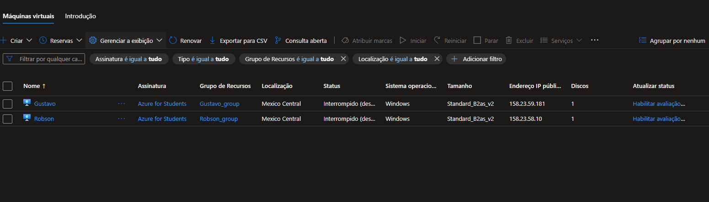
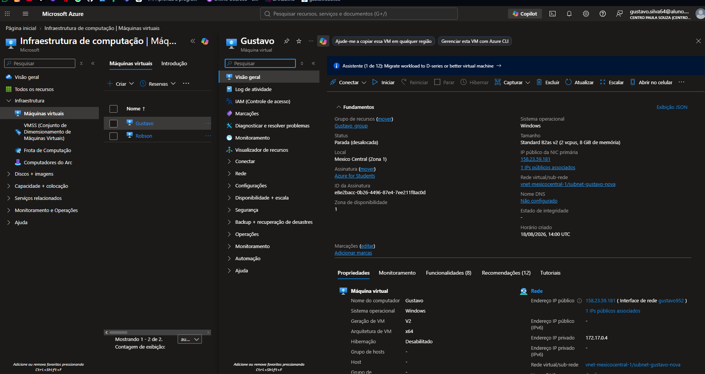
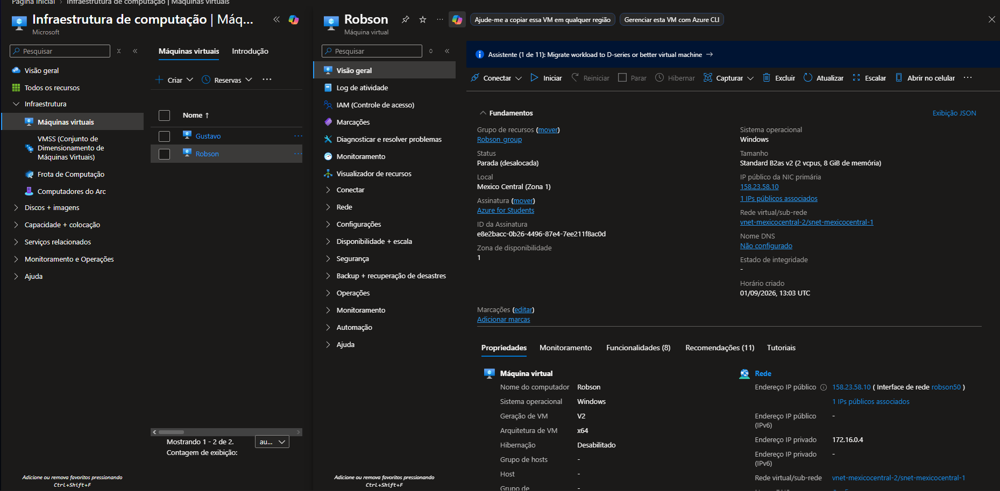
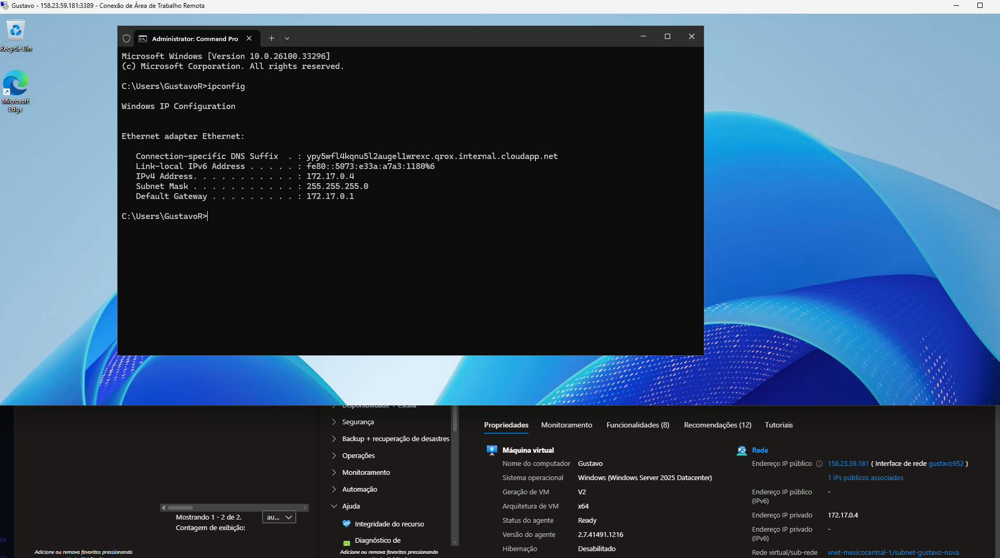
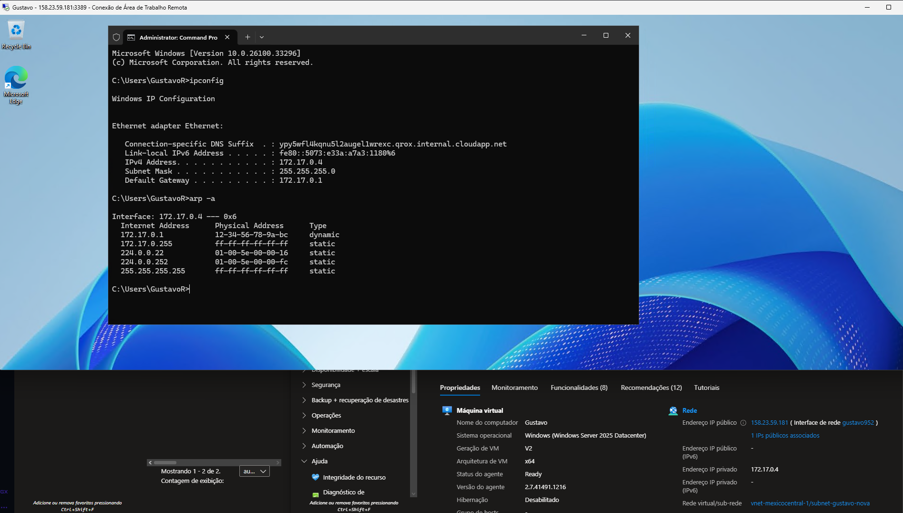
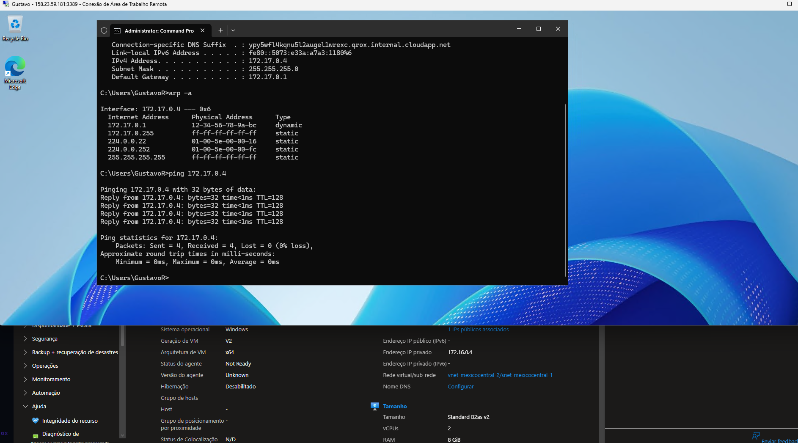

# Atividade Prática — Microsoft Azure

## 👨‍💻 Aluno

**Gustavo Robson**

## 📌 Objetivo

Esta atividade prática tem como objetivo demonstrar a criação e configuração de duas máquinas virtuais no **Microsoft Azure**, além da realização de testes básicos de rede e acesso remoto utilizando **RDP**.

Foram utilizadas duas máquinas virtuais com sistema operacional Windows:

- **Gustavo**
- **Robson**

---

## ☁️ Máquinas Virtuais

As duas máquinas virtuais foram criadas no Microsoft Azure utilizando a assinatura **Azure for Students**.

### VM Gustavo

- **Nome:** Gustavo
- **Sistema operacional:** Windows
- **Tamanho:** Standard B2as v2
- **vCPUs:** 2
- **Memória:** 8 GiB
- **Região:** Mexico Central
- **Grupo de recursos:** `Gustavo_group`
- **IP privado:** `172.17.0.4`
- **Rede virtual:** `vnet-mexicocentral-1`
- **Sub-rede:** `subnet-gustavo-nova`

### VM Robson

- **Nome:** Robson
- **Sistema operacional:** Windows
- **Tamanho:** Standard B2as v2
- **vCPUs:** 2
- **Memória:** 8 GiB
- **Região:** Mexico Central
- **Grupo de recursos:** `Robson_group`
- **IP privado:** `172.16.0.4`
- **Rede virtual:** `vnet-mexicocentral-2`
- **Sub-rede:** `snet-mexicocentral-1`

### Evidência das máquinas virtuais



---

## ⚙️ Configuração da VM Gustavo

A imagem abaixo apresenta as principais configurações da máquina virtual Gustavo, incluindo sistema operacional, tamanho, arquitetura, grupo de recursos e informações de rede.



---

## ⚙️ Configuração da VM Robson

A imagem abaixo apresenta as principais configurações da máquina virtual Robson, incluindo sistema operacional, tamanho, arquitetura, grupo de recursos e informações de rede.



---

## 🌐 Configuração e testes de rede

Foram realizados testes utilizando o **Prompt de Comando (CMD)** dentro da máquina virtual Gustavo.

### 1. Comando `ipconfig`

O comando `ipconfig` foi utilizado para consultar as configurações de rede da máquina.

Resultado observado:

- **IPv4:** `172.17.0.4`
- **Máscara de sub-rede:** `255.255.255.0`
- **Gateway padrão:** `172.17.0.1`



---

### 2. Comando `arp -a`

O comando `arp -a` foi utilizado para visualizar a tabela ARP da interface de rede da máquina virtual.



---

### 3. Comando `ping`

Foram realizados testes utilizando o comando `ping`.

Primeiramente foi realizado um teste para o próprio endereço IP da VM Gustavo:

```cmd
ping 172.17.0.4
```

O teste apresentou:

- **4 pacotes enviados**
- **4 pacotes recebidos**
- **0% de perda**

Também foi realizado um teste para o endereço privado da VM Robson:

```cmd
ping 172.16.0.4
```

Nesse teste houve **100% de perda**, com mensagens `Request timed out`.

As duas máquinas estão configuradas em redes virtuais diferentes, o que deve ser considerado na análise da conectividade entre elas.



---

## 🖥️ Acesso remoto via RDP

O acesso à máquina virtual **Gustavo** foi realizado utilizando o protocolo **RDP (Remote Desktop Protocol)**.

A conexão foi feita por meio do aplicativo **Conexão de Área de Trabalho Remota** do Windows, utilizando o endereço público disponibilizado pelo Azure.

Os testes de `ipconfig`, `arp` e `ping` foram executados dentro da sessão RDP da máquina virtual.

---

## 📚 Tecnologias e recursos utilizados

- Microsoft Azure
- Máquinas Virtuais (Azure Virtual Machines)
- Windows
- Remote Desktop Protocol (RDP)
- Prompt de Comando (CMD)
- IPv4
- ARP
- ICMP / Ping

---

## ✅ Conclusão

A atividade permitiu colocar em prática a criação de máquinas virtuais no Microsoft Azure, a visualização de suas configurações de infraestrutura e rede, o acesso remoto por RDP e a utilização de comandos básicos para diagnóstico de rede.

Foram criadas duas máquinas virtuais Windows e realizados os testes solicitados utilizando `ipconfig`, `arp -a` e `ping`.
